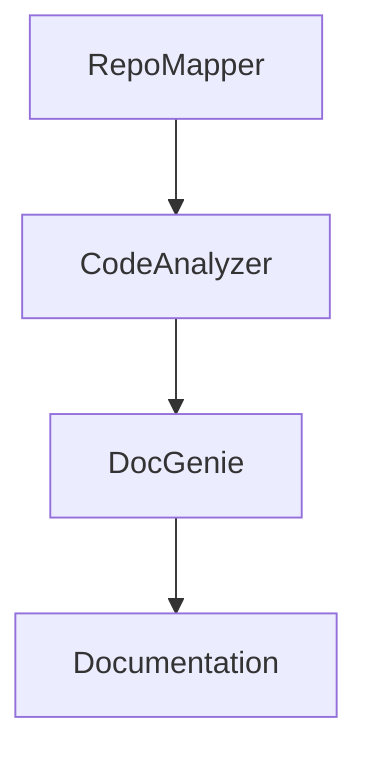

# Codebase Genius  
### *Autonomous Documentation & Code Mapping Agent for Jac + Python Repositories*

---

## 📜 Overview  

**Codebase Genius** is an AI-powered codebase analyzer and documentation generator that automatically:

- 🧩 **Clones and indexes** GitHub repositories.  
- 🧠 **Parses source code** (Python + JacLang + others) to extract classes, functions, nodes, edges & walkers.  
- 🔍 **Builds a Code Call Graph (CCG)** to map dependencies and function calls.  
- 🪄 **Generates structured Markdown documentation** with dynamic Mermaid diagrams.  
- 💬 **Integrates LLM-powered summaries** and contextual insights for every repository.  

Built on **JacLang 0.8+** and **byLLM**, it combines graph-based reasoning with LLM semantics to create a truly autonomous developer assistant.

---

## 🧱 Core Architecture 
```
mermaid
graph TD
    A[RepoMapper] --> B[CodeAnalyzer]
    B --> C[DocGenie]
    C --> D[Markdown Documentation]
    D --> E[Generated Mermaid Diagram + File Tree]
    A --> F[GitPython + Local Clone]
    B --> G[LLM Structural Analysis &#40;ReAct via byLLM&#41;]
```

| **Module**          | **Purpose**                                                                               |
| ------------------- | ----------------------------------------------------------------------------------------- |
| 🧩 **RepoMapper**   | Clones repositories via GitPython, collects files, and summarizes the README.             |
| 🧠 **CodeAnalyzer** | Uses LLM via byLLM to detect classes, functions, nodes, walkers & call relations.         |
| 🪄 **DocGenie**     | Generates structured Markdown documentation with architecture and component summaries.    |
| 🚀 **Supervisor**   | The main execution walker (`codegenius_supervisor`) that coordinates the entire pipeline. |


## ⚙️ Features
```
✅ Automatic cloning and indexing of any public GitHub repo
✅ Cross-language support (Python, JacLang, JavaScript, TypeScript, etc.)
✅ LLM-based structural understanding of functions and class hierarchies
✅ Mermaid graph visualizations of code relationships
✅ Auto-generated Markdown documentation with Overview, Usage, Architecture & Future Work
✅ Jac-Cloud backend and Streamlit frontend integration
✅ Fully containerized and deployable with Jac Cloud runtime

```
## 🧩 Repository Structure
```
Code_Base_Genius/
│
├── BE/                      # Backend (Jac + Python Core)
│   ├── __pycache__/
│   ├── generated_docs/
│   ├── code_analyzer.jac
│   ├── doc_genie.jac
│   ├── main.jac
│   ├── repo_mapper.jac
│   ├── repo_utils.py
│   └── supervisor.jac
│
├── FE/                      # Frontend (Streamlit App)
│   └── app.py
│
├── .env
├── .env.example
├── .gitignore
├── readMe
├── requirements.txt
└── README.md
```
## ⚡ Quick Start
### 1️⃣ Clone the repository
```
git clone https://github.com/<your-username>/Codebase_Base_Genius.git
cd Codebase_Base_Genius
 ```
### 2️⃣ Install dependencies
```
pip install -r requirements.txt
```
### 3️⃣ Run Jac server
```
jac serve main.jac
```
This starts Codebase Genius locally and serves the jac-cloud backend at:
http://localhost:8000

### 4️⃣ Analyze a GitHub repository
If you prefer to trigger analysis manually through a terminal or script:
```
curl -X POST http://localhost:8000/walker/codegenius_supervisor \
-H "Content-Type: application/json" \
-d '{"body":{"repo_url":"https://github.com/Qooley/system_shared_repo.git"}}'
```
This will automatically clone, analyze, and generate documentation for the specified repository.

### 5️⃣ View generated documentation
After processing, Markdown documentation is saved in:
```
generated_docs/<repo_name>.md
```
The generated files include:

Code structure summaries (classes, functions, nodes, walkers)

Mermaid diagrams for call graphs

Overview and insights powered by byLLM

### 6️⃣ Launch the Streamlit Frontend
```
streamlit run FE/app.py
```
This launches the interactive Codebase Genius dashboard, where users can:
```
🧩 Enter a GitHub repository URL (e.g. https://github.com/Qooley/system_shared_repo.git)

🚀 Submit it for analysis — the frontend sends it to the backend API automatically

⏳ Wait as Codebase Genius processes and generates documentation

📖 View, browse, and interact with the results (Markdown + Mermaid visualization)
```

Frontend default URL:
http://localhost:8501

### 🧩 Full Workflow Summary

| **Step** | **Component**                           | **Purpose**                                                                     |
| -------- | --------------------------------------- | ------------------------------------------------------------------------------- |
| 1️⃣      | **Backend (Jac Cloud)** — `BE/main.jac` | Runs repo cloning, LLM-based parsing, and documentation generation              |
| 2️⃣      | **Frontend (Streamlit)** — `FE/app.py`  | Lets users input GitHub URLs, submit jobs, and wait for documentation rendering |
| 3️⃣      | **Output** — `BE/generated_docs/`       | Markdown and Mermaid diagrams automatically saved and displayed                 |


## 🧰 Technical Stack

| **Layer**                 | **Technologies**                   | **Description**                                                  |
| ------------------------- | ---------------------------------- | ---------------------------------------------------------------- |
| **Language Runtime**      | JacLang 0.8+, Python 3.12          | Hybrid graph + imperative scripting environment for AI agents.   |
| **LLM Integration**       | byLLM, LiteLLM, OpenAI GPT-4o-mini | LLM interface for reasoning and structured code summarization.   |
| **Backend API**           | FastAPI, Uvicorn                   | Serves REST endpoints for repo analysis and document generation. |
| **Frontend (UI)**         | Streamlit                          | Dashboard for repository upload and documentation visualization. |
| **Repository Management** | GitPython, gitdb                   | For cloning and indexing GitHub repositories.                    |
| **Visualization**         | Mermaid-Py, Graphviz               | Generates architecture diagrams inside Markdown.                 |
| **Utilities**             | python-dotenv, tqdm, rich          | Handles environment, logging, and progress tracking.             |

## 🧪 Example Output Snippet
### Codebase Documentation — system_shared_repo

### Overview
- Purpose: Demonstrate Python and JacLang integration for Week 1 Assignment  
- Main Modules: foodcatalogue.py, main_inject.py, week1_build.jac  
- Features: Automated documentation and class/function extraction  

### Architecture Diagram


---

## 🧩 Environment Variables (`.env`)

```bash
OPENAI_API_KEY=your_api_key_here
DATABASE_HOST=localhost
```

## 🚀 Deployment
Run locally
```
jac serve main.jac
```
## 🔐 Security Notes

Never commit your .env or API keys.

Use the provided .gitignore to exclude sensitive or generated files.

## 🧭 Roadmap

 Add interactive Streamlit frontend for repo upload and visualization

 Enhance LLM prompt tuning for structural detection accuracy

 Integrate real-time graph visualization via PyVis

 Add Docker and Kubernetes deployment manifests

## 📜 License

This project is licensed under the OUK, Jaseci Labs, Marrion Kiprop

## 👩‍💻 Maintainer

Marrion Kiprop Cherop
Founder — Agricore Technologies | Creator of Codebase Genius

---

✅ **Save and push:**
```bash
nano README.md
# paste all content above
git add README.md
git commit -m "Add detailed README for Codebase Genius"
git push origin main
```
